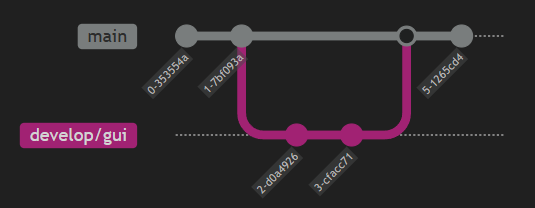
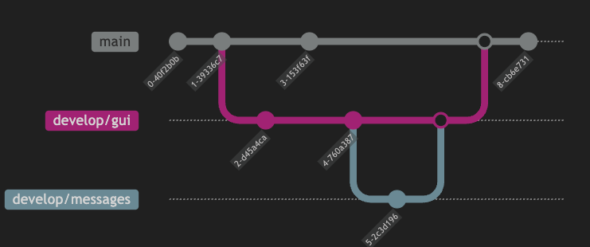

# 3 Commits, Branches, Merges
### 1 Was ist der Unterschied zwischen einem lokalen Repository und einem remote Repository?
- Ein lokales Repository liegt auf dem eigenen Rechner und enthält den vollständigen Projektverlauf inkl. Commits, Branches und Tags.
- Ein remote Repository liegt auf einem Server (z. B. GitLab) und dient als zentrale Austausch- und Sicherungsstelle für mehrere Entwickler.

### 2 Mit welchem Befehl kann ein Repository, welches auf GitLab abgespeichert ist, auf einen lokalen Speicherpfad kopiert werden?
``git clone <repository-url>``

### 3 Du hast ein lokales Repository. Zwischenzeitig wurde auf dem remote Repository eine Änderung vorgenommen. Mit welchem Befehl kann die Änderung im lokalen Repository übernommen werden?
``git pull``

### 4 Mit welcher Befehlsabfolge können Änderungen an einem lokalen Repository auf ein remote Repository übertragen werden?
``git add .``

``git commit -m "message"``

``git push``

### 5 Wozu werden Branches genutzt?
Branches werden genutzt, um parallel und isoliert an Features, Bugfixes oder Experimenten zu arbeiten, ohne den stabilen Hauptzweig zu gefährden.
Sie ermöglichen saubere Entwicklung, Code-Reviews und kontrollierte Merges.

### 6.1 Was stellst du auf dem Branch main fest?
Auf dem Branch ``main`` ist keine der neuen Änderungen sichtbar:
- README.md ist unverändert (Originalzustand beim Clone)
- Die Datei main.cpp existiert nicht
- Der Branch enthält nur den Stand, der beim Klonen des Repositories vorhanden war

### 6.2 Was stellst du auf dem Branch develop fest?
Auf dem Branch ``develop`` gilt:
- Die Datei main.cpp existiert
- README.md ist unverändert
- Änderungen aus doc/readme-instructions sind nicht sichtbar

### 6.3 Was stellst du auf dem Branch doc/readme-instructions fest?
Auf dem Branch ``doc/readme-instructions`` gilt:
- Die Datei README.md ist geändert
- Die Datei main.cpp existiert nicht
- Änderungen aus develop sind nicht vorhanden

### 7 Welche Vorbereitungen müssen beim Mergen getroffen werden und weshalb?
Vor dem Mergen muss sichergestellt werden, dass der Ziel-Branch aktuell ist (z. B. durch git pull) und dass der zu mergende Branch fehlerfrei ist.
Dazu gehören kompilierbarer Code, erfolgreiche Tests und ein sauberer Working Tree ohne uncommittete Änderungen.

Zusätzlich sollten Merge-Konflikte vorab geprüft und wenn möglich bereits im Feature-Branch gelöst werden.

Diese Vorbereitungen sind notwendig, um Konflikte, Build-Fehler und instabile Zustände im Ziel-Branch zu vermeiden und die Integrität des Repositories sicherzustellen.

### 8 Beschreibe die Befehle für diesen Vorgang:

``git checkout main``

``git pull``

``git add <changed files>``

``git commit -m "commit 0"``

``git add <changed files>``

``git commit -m "commit 1``

``git push``

---

``git checkout -b develop/gui``

---

``git add .``

``git commit -m "commit 2"``

``git add .``

``git commit -m "change 3"``

``git push``

---

``git checkout main``

---

``git merge develop/gui``

---

``git branch -d develop/gui``

---

``git add <changes files>``

``git commit -m "commit 5"``

``git push``

### 9 Beschreibe die Befehle für diesen Vorgang:
